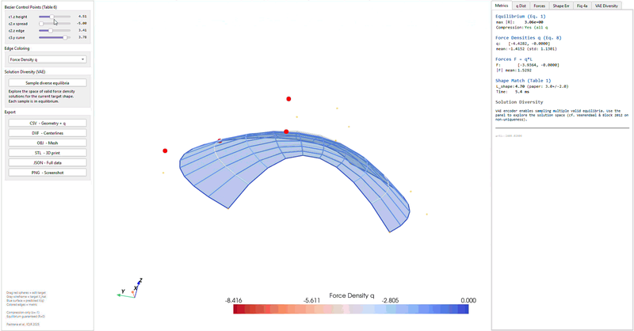

# VAE-FDM

**Variational form-finding for architectural structures with guaranteed equilibrium**

[](https://arxiv.org/abs/2409.02606)
[](https://openreview.net/forum?id=Tpjq66xwTq)
[](https://www.python.org)
[](LICENSE)
[](#testing)
[](https://huggingface.co/spaces/Efradeca/vae-fdm)

<p align="center">
  
</p>

VAE-FDM couples a **Variational Autoencoder** with a **differentiable Force Density Method** solver to generate diverse mechanically valid structural forms in real time. Every predicted shape satisfies equilibrium by construction: the physics decoder guarantees it.

> **Disclaimer**: This is a research tool for exploring structural form-finding, **not a structural design software**. Results are for educational and research purposes only. Structural design for construction requires analysis by a licensed Professional Engineer using validated FEM software. See [Scope and Limitations](#scope-and-limitations).

**[Try the live demo on Hugging Face](https://huggingface.co/spaces/Efradeca/vae-fdm)** No installation required. Drag control points and explore shell geometries directly in the browser.



## Key Ideas

The [Force Density Method](https://doi.org/10.1016/0045-7825(74)90045-0) (Schek, 1974) computes equilibrium shapes for pin-jointed bar systems. [Pastrana et al. (ICLR 2025)](https://arxiv.org/abs/2409.02606) showed that coupling a neural encoder with a differentiable FDM decoder enables real-time form-finding with guaranteed physics.

**Our contributions build on their work:**

1. **Variational encoder**: The inverse problem (shape → force densities) has [infinitely many solutions](https://doi.org/10.1016/j.ijsolstr.2012.08.008) (Veenendaal & Block, 2012). We replace the deterministic MLP encoder with a VAE ([Kingma & Welling, 2014](https://arxiv.org/abs/1312.6114)) to sample from this solution space. Each sample passes through the FDM decoder and produces a valid equilibrium shape.

2. **GNN encoder**: A message-passing neural network ([Gilmer et al., 2017](https://arxiv.org/abs/1704.01212)) that works on variable mesh topologies, removing the fixed-grid limitation of the original MLP encoder.

3. **Interactive explorer**: A standalone Qt + PyVista application that reproduces the real-time design workflow shown in the paper's Figure 14, without requiring Rhino3D ($995).

## Paper Reproduction

We reproduce Table 1 of [Pastrana et al. (ICLR 2025)](https://arxiv.org/abs/2409.02606) with the same evaluation protocol (100 shapes, seed=90):

| Metric | VAE-FDM | Paper | Reference |
|--------|:-------:|:-----:|-----------|
| L_shape | 3.2 ± 2.1 | 3.0 ± 2.0 | Table 1 |
| L_physics | 0.0 ± 0.0 | 0.0 ± 0.0 | Table 1 |
| Compression | all q ≤ 0 | all q ≤ 0 | Section 4.1 |

Independent numerical reproduction of the paper's results. Full script: `python benchmarks/reproduce_paper.py`

## Installation

```bash
git clone https://github.com/efradeca/vae-fdm.git
cd vae-fdm
pip install -e .

# For the interactive explorer (includes PyVista, PySide6, ezdxf)
pip install -e ".[vis]"
```

## Usage

```bash
cd scripts

# Train the deterministic formfinder (paper baseline, ~3 min)
python train.py formfinder bezier

# Train the variational formfinder (our extension)
python train.py variational_formfinder variational_bezier

# Evaluate (paper Table 1)
python predict.py formfinder bezier --batch_size=100 --seed=90

# Launch the interactive explorer
python interactive_designer.py
```

## Interactive Explorer

The explorer shows only paper-validated metrics with equation references:

- **Sliders** control Bezier surface parameters (paper Table 6 ranges)
- **3D viewport** renders target (wireframe) vs predicted equilibrium (surface)
- **Tabs**: Metrics, q distribution, force distribution, shape error, training curves, VAE diversity
- **Export**: CSV, DXF (AutoCAD/ETABS/Robot), OBJ, STL, JSON, PNG

The "Sample diverse equilibria" button generates multiple valid solutions from the VAE for the same target shape, visualizing where the structure has design freedom.

## Testing

```bash
pytest tests/ -v                              # 76 unit tests
python benchmarks/verify_all.py               # 11 verification checks
python benchmarks/validation_suite.py         # 13 triple validation checks
python benchmarks/reproduce_paper.py          # Paper Table 1 reproduction
python benchmarks/benchmark_architectures.py  # MLP vs GNN comparison
```

100 total checks (76 tests + 11 verification + 13 validation), all passing.

## Project Structure

```
src/neural_fdm/
├── models.py           # Encoder/decoder architecture [paper]
├── variational.py      # VAE encoder, KL divergence, beta schedule [ours]
├── gnn.py              # GNN encoder with message passing [ours]
├── graph.py            # Graph data structures for GNN [ours]
├── losses.py           # Shape, residual, KL losses
├── helpers.py          # FDM equilibrium math (Schek 1974)
├── training.py         # JIT-compiled training with VAE support
├── builders.py         # Factory functions
├── generators/         # Bezier and tube data generators
└── interop/            # NumPy API for external tools

scripts/
├── interactive_designer.py   # Qt+PyVista explorer
├── train.py                  # Training entry point
└── *.yml                     # Configurations

benchmarks/                   # Validation suites
tests/                        # 76 unit tests
examples/                     # Usage examples
```

## Scope and Limitations

**What is guaranteed** (paper-validated):
- Equilibrium of pin-jointed bar systems (R = 0)
- Compression-only forces for shell task (q ≤ 0)
- Real-time inference (~1ms on Apple M2)

**What this tool is NOT**:
- Not a structural design software
- Not a replacement for FEM analysis (ETABS, SAP2000, Robot, RFEM)
- Not validated for construction use
- Not a substitute for review by a licensed Professional Engineer

See [`disclaimer.py`](src/neural_fdm/disclaimer.py) for scope details.

## References

1. Pastrana, R. et al. (2025). *Real-time design of architectural structures with differentiable mechanics and neural networks.* ICLR 2025. [arXiv:2409.02606](https://arxiv.org/abs/2409.02606)
2. Kingma, D.P. & Welling, M. (2014). *Auto-Encoding Variational Bayes.* ICLR 2014. [arXiv:1312.6114](https://arxiv.org/abs/1312.6114)
3. Schek, H.J. (1974). *The force density method for form finding and computation of general networks.* CMAME, 3(1):115-134.
4. Veenendaal, D. & Block, P. (2012). *An overview and comparison of structural form finding methods for general networks.* IJSS, 49(26):3741-3753.
5. Fu, H. et al. (2019). *Cyclical annealing schedule: A simple approach to mitigating KL vanishing.* NAACL 2019.
6. Gilmer, J. et al. (2017). *Neural message passing for quantum chemistry.* ICML 2017.

## Citation

If you use this software, please cite both the original paper and this repository:

```bibtex
@inproceedings{pastrana2025realtime,
  title={Real-Time Design of Architectural Structures with Differentiable
         Mechanics and Neural Networks},
  author={Pastrana, Rafael and Medina, Eder and de Oliveira, Isabel M.
          and Adriaenssens, Sigrid and Adams, Ryan P.},
  booktitle={International Conference on Learning Representations},
  year={2025}
}

@software{deulofeu2026vaefdm,
  author={Deulofeu, Efrain},
  title={VAE-FDM: Variational autoencoder for differentiable
         structural form-finding},
  url={https://github.com/efradeca/vae-fdm},
  year={2026},
  note={Extends Pastrana et al. (ICLR 2025)}
}
```

## License

[MIT License](LICENSE). See [Code of Conduct](CODE_OF_CONDUCT.md) and [Contributing](CONTRIBUTING.md).

---

*This software is provided as-is for research and educational purposes. It is not intended for, and should not be used for, structural design of buildings or any construction application without independent verification by qualified professionals.*
